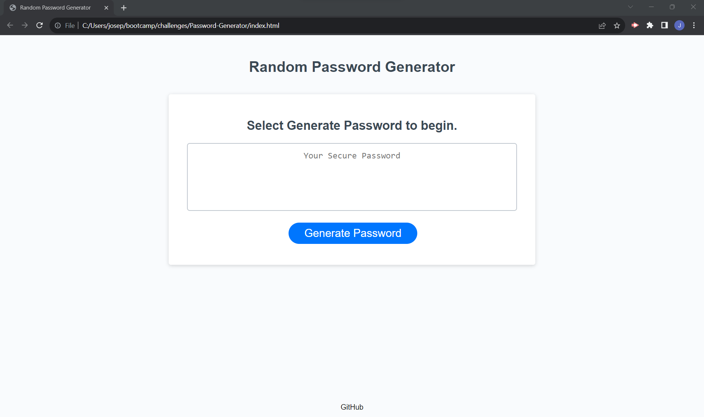

# Random Password Generator

## Description

Using JavaScript, the user can select uppercase, lowercase, numbers, and/or special characters to randomly generate a password in length between 8 and 128 characters.

- Linked JavaScript to the HTML file
- Created a prompt for the user to select password length
- Created an alert if the password length is not within the boundary conditions
- Created variables to include or exclude character type
- Created an alert if the password does not include any uppercase, lowercase, numerical, or special characters
- Created if statements to concatenate selected character types until the desried length is met
- Created a function for generating a password given the selected criteria

## Link to Site

## Screenshot

